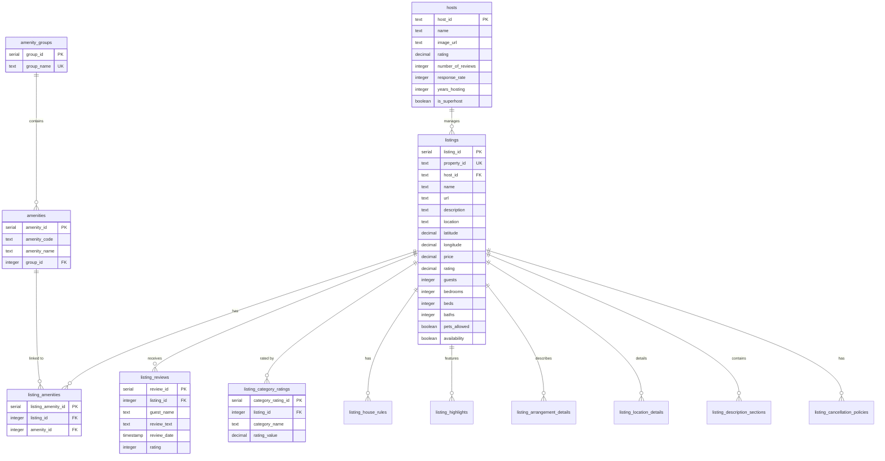
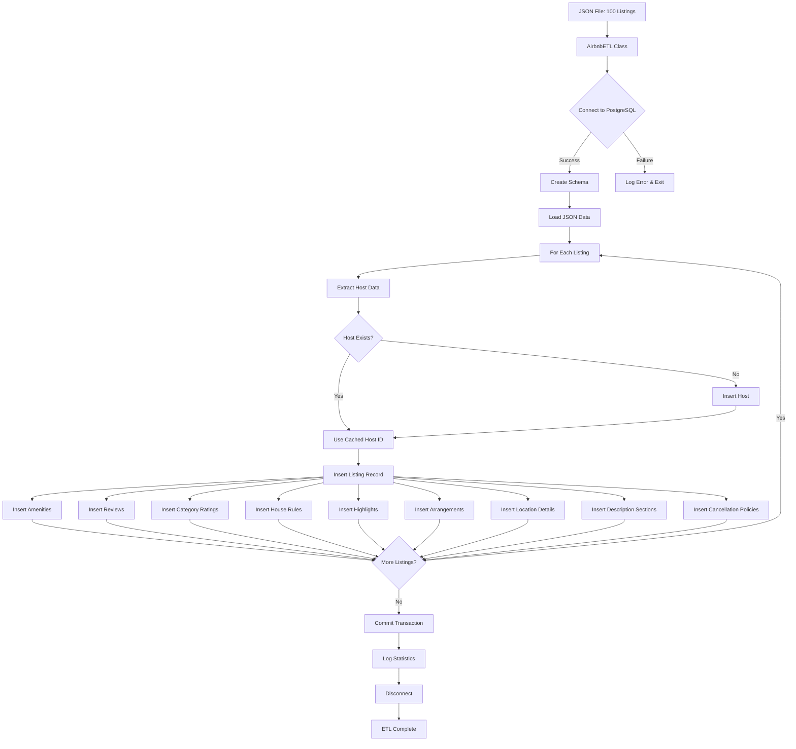

# Airbnb Listings Database Normalization

## Overview

This project normalizes web-scraped Airbnb listing data from Calgary's Beltline neighborhood into a PostgreSQL relational database following Third Normal Form (3NF) principles.

## Database Schema Design

### Entity-Relationship Model

The database consists of 15 tables organized into three categories:

#### **Core Entities**
1. **hosts** - Unique host/property manager information
2. **listings** - Main property listing data
3. **amenity_groups** - Categories for grouping amenities
4. **amenities** - Master list of all amenities

#### **Relationship Tables**
5. **listing_amenities** - Many-to-many relationship between listings and amenities
6. **listing_reviews** - Guest reviews with detailed metadata
7. **listing_category_ratings** - Ratings by category (Cleanliness, Accuracy, etc.)
8. **listing_house_rules** - Rules for each listing
9. **listing_highlights** - Special features and selling points
10. **listing_arrangement_details** - Room and bed arrangements
11. **listing_location_details** - Detailed location descriptions
12. **listing_description_sections** - Structured descriptions by section
13. **listing_cancellation_policies** - Cancellation policy details

### Entity Relationships



## ETL Pipeline Architecture

### Flow Diagram



### How the ETL Works

1. **Initialization**: Creates database connection and initializes caches for lookup tables
2. **Schema Creation**: Executes SQL to create all tables with proper constraints
3. **Data Extraction**: Reads and parses JSON file containing 100 Airbnb listings
4. **Data Transformation**: For each listing:
   - Normalizes nested structures into relational format
   - Extracts host information
   - Parses dates and numeric values
   - Splits combined fields (e.g., "2 bedrooms" → 2)
5. **Data Loading**: 
   - Inserts hosts first (deduplicates using cache)
   - Inserts main listing record
   - Inserts all related records in child tables
   - Uses foreign key relationships to maintain referential integrity
6. **Transaction Management**: Commits all changes or rolls back on error

## Directory Structure

```
Airbnb_Price_Optimization/
├── Resources/
│   └── airbnb_beltline_calgary_listings_100.json  (Input: 100 listings)
├── database_normalized_schema.sql                             (Schema definition)
├── etl_airbnb_normalized_postgres.py                      (ETL pipeline)
└── README_DATABASE.md                             (This file)
```

## Environment Setup

### Prerequisites

- Python 3.8+
- PostgreSQL 12+
- Required Python packages: `psycopg2`, `python-dotenv` (optional)

### Installation

1. **Install PostgreSQL** (if not already installed)

2. **Install Python dependencies**:
   ```bash
   uv pip install psycopg2-binary
   ```

3. **Create PostgreSQL database**:
   ```sql
   CREATE DATABASE airbnb_db;
   ```

4. **Configure database connection**:
   Create a `.env` file or edit `etl_airbnb_normalized_postgres.py`:
   ```python
   # .env file
   DB_HOST=localhost
   SOURCE_DB_NAME=airbnb_db
   DB_USER=your_username
   DB_PASSWORD=your_password
   DB_PORT=5432
   NORMALIZED_SCHEMA_FILE=database_normalized_schema.sql
   JSON_FILE=Resources/airbnb_beltline_calgary_listings_100.json
   ```

## Usage Guide

### Running the ETL Pipeline

**Basic execution**:
```bash
python etl_airbnb_normalized_postgres.py
```

**Using the AirbnbETL class programmatically**:
```python
from etl_airbnb_normalized_postgres import AirbnbETL
import os
from dotenv import load_dotenv

load_dotenv()

# Configure database (reads from .env)
db_config = {
    'host': os.getenv('DB_HOST', 'localhost'),
    'database': os.getenv('SOURCE_DB_NAME', 'airbnb_db'),
    'user': os.getenv('DB_USER', 'postgres'),
    'password': os.getenv('DB_PASSWORD'),
    'port': int(os.getenv('DB_PORT', '5432'))
}

# Initialize ETL
etl = AirbnbETL(db_config)

# Run ETL with schema recreation
etl.run_etl(
    json_file=os.getenv('JSON_FILE', 'Resources/airbnb_beltline_calgary_listings_100.json'),
    schema_file=os.getenv('NORMALIZED_SCHEMA_FILE', 'database_normalized_schema.sql'),
    recreate_schema=True  # Set False to keep existing data
)
```

### Input Files

**External File Required**: `Resources/airbnb_beltline_calgary_listings_100.json`
- Format: JSON array of listing objects
- Contains: 100 web-scraped Airbnb listings from Beltline, Calgary
- Each listing includes: property details, host info, amenities, reviews, ratings, etc.

### Example Queries

**Find top-rated listings with mountain views**:
```sql
SELECT l.name, l.rating, l.price, h.highlight_value
FROM listings l
JOIN listing_highlights h ON l.listing_id = h.listing_id
WHERE h.highlight_name = 'Mountain view'
  AND l.rating >= 4.5
ORDER BY l.rating DESC, l.price ASC;
```

**Get average rating by amenity group**:
```sql
SELECT ag.group_name, 
       COUNT(DISTINCT l.listing_id) as listing_count,
       AVG(l.rating) as avg_rating,
       AVG(l.price) as avg_price
FROM amenity_groups ag
JOIN amenities a ON ag.group_id = a.group_id
JOIN listing_amenities la ON a.amenity_id = la.amenity_id
JOIN listings l ON la.listing_id = l.listing_id
GROUP BY ag.group_name
ORDER BY avg_rating DESC;
```

**Find superhosts with best response rates**:
```sql
SELECT h.name, h.rating, h.response_rate, h.number_of_reviews,
       COUNT(l.listing_id) as num_listings
FROM hosts h
LEFT JOIN listings l ON h.host_id = l.host_id
WHERE h.is_superhost = TRUE
GROUP BY h.host_id, h.name, h.rating, h.response_rate, h.number_of_reviews
ORDER BY h.response_rate DESC, h.rating DESC;
```

## Data Normalization Principles Applied

### First Normal Form (1NF)
- Eliminated repeating groups (e.g., multiple amenities per listing)
- Each cell contains atomic values
- All entries in a column are of the same type

### Second Normal Form (2NF)
- All non-key attributes fully depend on the primary key
- Removed partial dependencies by creating separate tables for hosts, amenities

### Third Normal Form (3NF)
- Eliminated transitive dependencies
- Created lookup tables for amenity groups
- Separated host details from listing information
- No non-key attribute depends on another non-key attribute

## Benefits of This Schema

1. **Data Integrity**: Foreign key constraints prevent orphaned records
2. **No Redundancy**: Host information stored once, referenced by multiple listings
3. **Scalability**: Easy to add new listings, hosts, or amenities
4. **Query Efficiency**: Proper indexing on foreign keys and commonly queried columns
5. **Flexibility**: Can easily extend schema with new tables or relationships
6. **Maintainability**: Clear separation of concerns between entities

## Performance Considerations

- **Indexes**: Created on foreign keys, rating columns, price, location coordinates
- **Caching**: ETL uses in-memory caches to avoid duplicate lookups during loading
- **Batch Processing**: Single transaction for entire dataset ensures atomicity
- **Connection Pooling**: Can be added for production environments with high concurrency

## Troubleshooting

**Issue**: `psycopg2` import errors
- **Solution**: Install with `pip install psycopg2-binary`

**Issue**: Connection refused
- **Solution**: Verify PostgreSQL is running and credentials are correct

**Issue**: Schema creation fails
- **Solution**: Ensure user has CREATE TABLE privileges

**Issue**: Duplicate key violations
- **Solution**: Set `recreate_schema=True` to drop existing tables

## Future Enhancements

- Add support for incremental updates (upsert logic)
- Implement connection pooling for concurrent operations
- Add data validation rules (e.g., price > 0, valid coordinates)
- Create materialized views for common analytics queries
- Add full-text search on descriptions and reviews
- Implement change data capture (CDC) for tracking updates
