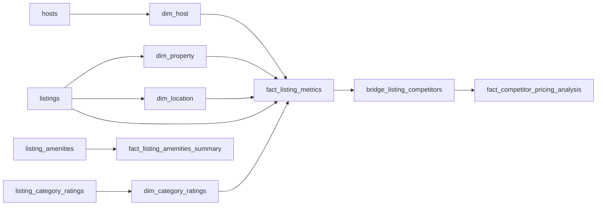

# Airbnb Dimensional Database Model - Documentation

## Overview

This dimensional model transforms the normalized Airbnb database into a star schema optimized for:
1. **Competitor Analysis**: Identifying top 25 similar listings based on multi-dimensional similarity
2. **Price Optimization**: Calculating optimal pricing based on competitor market analysis
3. **Business Intelligence**: Fast OLAP queries for analytics and reporting

## Architecture: Star Schema

```
                    ┌─────────────────┐
                    │   dim_date      │
                    └────────┬────────┘
                             │
    ┌─────────────┐         │         ┌──────────────────┐
    │  dim_host   │─────────┤         │  dim_location    │
    └─────────────┘         │         └──────────────────┘
                            │
                    ┌───────▼──────────┐
                    │ fact_listing_    │
                    │    metrics       │◄────┐
                    │  (CENTRAL FACT)  │     │
                    └───────┬──────────┘     │
                            │                │
    ┌─────────────┐         │         ┌─────┴────────────┐
    │ dim_property│─────────┤         │ bridge_listing_  │
    └─────────────┘         │         │   competitors    │
                            │         └──────────────────┘
                    ┌───────▼──────────┐
                    │ dim_category_    │
                    │    ratings       │
                    └──────────────────┘
```

## Database Schema Components

### 📊 Core Tables

| Table | Type | Purpose | Rows (Estimated) |
|-------|------|---------|------------------|
| `fact_listing_metrics` | Fact | Central fact with pricing and performance | 100-1M |
| `dim_host` | Dimension | Host quality metrics | 50-500K |
| `dim_property` | Dimension | Property characteristics | 100-1M |
| `dim_location` | Dimension | Geographic clustering | 10-100K |
| `dim_category_ratings` | Dimension | Quality metrics | 100-1M |
| `dim_date` | Dimension | Time intelligence | 1K-10K |
| `bridge_listing_competitors` | Bridge | Many-to-many competitor relationships | 2.5K-25M |
| `fact_listing_amenities_summary` | Aggregate Fact | Amenity metrics | 100-1M |
| `fact_competitor_pricing_analysis` | Aggregate Fact | Price recommendations | 100-1M |

### 🔑 Key Design Decisions

1. **TEXT vs VARCHAR**: Using TEXT for all string columns (PostgreSQL best practice - no performance difference)
2. **Surrogate Keys**: SERIAL primary keys for all dimensions and facts
3. **Calculated Columns**: Pre-computed during ETL (not GENERATED columns) for flexibility
4. **Materialized View**: `view_top_competitors` for query performance
5. **Haversine Function**: Built-in distance calculation for geographic analysis

## Table Specifications

### 1. dim_host
**Purpose**: Host reputation and quality tier classification

**Key Columns**:
- `host_key` (PK): Surrogate key
- `host_id`: Business key from source system
- `host_name`: Host display name
- `host_response_rate`: Response rate percentage
- `host_response_time`: Response time description (e.g., "within an hour")
- `languages`: Languages spoken by host
- `my_work`: Host's work description
- `image_url`: Host profile image URL
- `profile_url`: Host profile URL on Airbnb
- `host_tier`: **CALCULATED** - Elite/Premium/Standard based on superhost status and rating
- `experience_level`: **CALCULATED** - Expert/Experienced/New based on years_hosting

**Calculation Logic**:
```python
host_tier = 
  if is_superhost and host_rating > 4.8: 'Elite'
  elif host_rating > 4.5: 'Premium'
  else: 'Standard'

experience_level =
  if host_years_hosting > 5: 'Expert'
  elif host_years_hosting > 2: 'Experienced'
  else: 'New'
```

---

### 2. dim_property
**Purpose**: Physical property attributes and capacity metrics

**Key Columns**:
- `property_key` (PK): Surrogate key
- `property_id`: Business key from source system
- `name`: Property name from listings
- `listing_name`: Formatted listing name
- `listing_title`: Property listing title
- `url`: Direct URL to Airbnb listing
- `description`: Full property description text
- `category`: Property category (e.g., "Entire home", "Private room")
- `property_size_tier`: **CALCULATED** - Studio/Small/Medium/Large
- `guest_per_bedroom_ratio`: **CALCULATED** - Space efficiency (guests/bedrooms)
- `bath_to_bedroom_ratio`: **CALCULATED** - Luxury indicator (baths/bedrooms)

**Calculation Logic**:
```python
property_size_tier =
  if bedrooms == 0: 'Studio'
  elif bedrooms == 1: 'Small'
  elif bedrooms in [2, 3]: 'Medium'
  else: 'Large'

guest_per_bedroom_ratio = guests_capacity / bedrooms
bath_to_bedroom_ratio = baths / bedrooms
```

---

### 3. dim_location
**Purpose**: Geographic positioning with clustering and distance metrics

**Key Columns**:
- `location_key` (PK): Surrogate key
- `location_cluster_id`: **CALCULATED** - K-means cluster (computed in Python/R)
- `distance_to_downtown_km`: **CALCULATED** - Using Haversine formula to Calgary downtown (51.0447, -114.0719)
- `location_tier`: **CALCULATED** - Urban Core/Downtown Adjacent/Neighborhood/Suburban

**Calculation Logic**:
```python
# Clustering (use sklearn in Python)
from sklearn.cluster import KMeans
kmeans = KMeans(n_clusters=10)
location_cluster_id = kmeans.fit_predict([[lat, long] for each location])

# Distance (use provided SQL function)
distance_to_downtown_km = calculate_distance_km(lat, long, 51.0447, -114.0719)

# Tier classification
location_tier =
  if distance_to_downtown_km < 1: 'Urban Core'
  elif distance_to_downtown_km < 3: 'Downtown Adjacent'
  elif distance_to_downtown_km < 7: 'Neighborhood'
  else: 'Suburban'
```

---

### 4. dim_category_ratings
**Purpose**: Guest experience quality scores

**Key Columns**:
- `rating_key` (PK): Surrogate key
- `overall_quality_score`: **CALCULATED** - Weighted average of all category ratings
- `quality_tier`: **CALCULATED** - Exceptional/Excellent/Good/Fair
- `value_index`: **CALCULATED** - Value rating / overall quality (identifies deals)

**Calculation Logic**:
```python
overall_quality_score = (
    cleanliness_rating * 0.25 +
    accuracy_rating * 0.15 +
    checkin_rating * 0.10 +
    communication_rating * 0.15 +
    location_rating * 0.15 +
    value_rating * 0.20
)

quality_tier =
  if overall_quality_score > 4.8: 'Exceptional'
  elif overall_quality_score > 4.5: 'Excellent'
  elif overall_quality_score > 4.0: 'Good'
  else: 'Fair'

value_index = value_rating / overall_quality_score
```

---

### 5. dim_date
**Purpose**: Time intelligence for temporal analysis

**Key Columns**:
- `date_key` (PK): Integer in YYYYMMDD format (e.g., 20250113)
- `season`: Calgary-specific seasons (Stampede, Summer Peak, Winter, Spring/Fall)

**Population**:
```sql
-- Populate for 2024-2026
SELECT populate_dim_date('2024-01-01'::DATE, '2026-12-31'::DATE);
```

---

### 6. fact_listing_metrics (Central Fact Table)
**Grain**: One row per listing per snapshot date

**Key Measures**:
- Base: `price_per_night`, `currency`, `listing_rating`, `number_of_reviews`
- **CALCULATED**:
  - `price_per_guest` = price_per_night / guests_capacity
  - `price_per_bedroom` = price_per_night / bedrooms
  - `price_per_bed` = price_per_night / beds
  - `review_velocity` = number_of_reviews / days_since_listing_created
  - `competitiveness_score` = f(rating, reviews, host_quality, amenities) [0-100]
  - `value_score` = quality_metrics / normalized_price [0-100]
  - `popularity_index` = (number_of_reviews × rating) / segment_average

**Metadata Columns**:
- `data_scraped_at`: Timestamp when the listing data was originally scraped from Airbnb
- `snapshot_date`: Date of this snapshot for time-series analysis
- `currency`: Price currency (default: 'CAD')

**Example Competitiveness Score Calculation**:
```python
competitiveness_score = (
    listing_rating / 5.0 * 30 +  # 30% weight
    min(number_of_reviews / 100, 1.0) * 25 +  # 25% weight
    host_rating / 5.0 * 20 +  # 20% weight
    amenity_score / 100 * 15 +  # 15% weight
    (1 if is_guest_favorite else 0) * 10  # 10% weight
)
```

---

### 7. fact_listing_amenities_summary
**Purpose**: Quantified amenity comparison

**Key Measures**:
- Counts: `total_amenities_count`, `essential_amenities_count`, `luxury_amenities_count`, `safety_amenities_count`
- **CALCULATED**:
  - `amenity_score` = essential_count×2 + luxury_count×3 + safety_count×1
  - `amenity_tier` = Luxury/Premium/Standard/Basic

**Amenity Classifications**:
```python
ESSENTIAL = ['Wifi', 'Kitchen', 'Parking', 'Air conditioning', 'Heating']
LUXURY = ['Pool', 'Gym', 'Hot tub', 'EV charger', 'Sauna']
SAFETY = ['Smoke alarm', 'Carbon monoxide alarm', 'First aid kit', 'Fire extinguisher']
```

---

### 8. bridge_listing_competitors
**Purpose**: Pre-computed competitor relationships (many-to-many)

**Key Columns**:
- `listing_key`, `competitor_listing_key`: The relationship
- `similarity_rank`: 1-25 (top 25 competitors)
- `overall_similarity_score`: **CALCULATED** - Composite score (0-100)
- Component scores: `location_similarity`, `property_similarity`, `quality_similarity`, `amenity_similarity`, `price_similarity`

**Similarity Calculation Formula**:
```python
overall_similarity_score = (
    location_similarity * 0.35 +
    property_similarity * 0.25 +
    quality_similarity * 0.20 +
    amenity_similarity * 0.10 +
    price_similarity * 0.10
)

# Component calculations:

# 1. Location Similarity (0-100)
location_similarity = (
    50 if same_cluster else 0
) + (100 * exp(-distance_km / 2))

# 2. Property Similarity (0-100)
property_similarity = (
    40 if bedrooms_match else 0
) + (
    30 if abs(guests_diff) <= 2 else 0
) + (
    30 * (1 - abs(beds_diff + baths_diff) / 10)
)

# 3. Quality Similarity (0-100)
quality_similarity = (
    100 - abs(rating_diff) * 20
) + (
    20 if same_quality_tier else 0
)

# 4. Amenity Similarity (0-100) - Jaccard Index
amenity_similarity = (
    len(shared_amenities) / len(total_unique_amenities)
) * 100

# 5. Price Similarity (0-100)
price_similarity = max(0, 100 - abs(price_diff_percent) * 2)
```

---

### 9. fact_competitor_pricing_analysis
**Purpose**: Aggregated pricing statistics and recommendations

**Key Measures**:
- Statistics: `avg_competitor_price`, `median_competitor_price`, percentiles
- **CALCULATED**:
  - `weighted_avg_price` = Σ(competitor_price × similarity_weight)
  - `price_premium_discount` = (current_price - weighted_avg_price) / weighted_avg_price × 100
  - `recommended_optimal_price` = weighted_avg_price × quality_adjustment_factor
  - `recommended_price_lower` = percentile_25_price × 0.95
  - `recommended_price_upper` = percentile_75_price × 1.05

**Price Optimization Algorithm**:
```python
# Calculate weighted average from top 25 competitors
weighted_avg_price = sum(
    competitor.price * competitor.similarity_weight
    for competitor in top_25_competitors
)

# Adjust for quality differential
quality_factor = listing.overall_quality_score / avg_competitor_quality_score

# Apply adjustment (±15% max)
quality_adjustment = min(max(quality_factor, 0.85), 1.15)

recommended_optimal_price = weighted_avg_price * quality_adjustment

# Set bounds
recommended_price_lower = percentile_25_price * 0.95
recommended_price_upper = percentile_75_price * 1.05
```

---

## ETL Transformation Flow

### Source: Normalized Database → Target: Dimensional Model



### ETL Steps

1. **Dimension Population** (SCD Type 1 - overwrite)
   ```sql
   -- Populate dim_host
   INSERT INTO dim_host (host_id, host_name, host_rating, ...)
   SELECT host_id, name, rating, ...
   FROM hosts;
   
   -- Calculate derived columns
   UPDATE dim_host SET 
       host_tier = CASE 
           WHEN is_superhost AND host_rating > 4.8 THEN 'Elite'
           WHEN host_rating > 4.5 THEN 'Premium'
           ELSE 'Standard'
       END,
       experience_level = CASE
           WHEN host_years_hosting > 5 THEN 'Expert'
           WHEN host_years_hosting > 2 THEN 'Experienced'
           ELSE 'New'
       END;
   ```

2. **Fact Table Population**
   ```sql
   -- Populate fact_listing_metrics
   INSERT INTO fact_listing_metrics (
       property_id, host_key, property_key, location_key, 
       rating_key, date_key, price_per_night, ...
   )
   SELECT 
       l.property_id,
       h.host_key,
       p.property_key,
       loc.location_key,
       r.rating_key,
       TO_CHAR(CURRENT_DATE, 'YYYYMMDD')::INTEGER,
       l.price_per_night,
       ...
   FROM listings l
   JOIN dim_host h ON l.host_id = h.host_id
   JOIN dim_property p ON l.property_id = p.property_id
   JOIN dim_location loc ON l.latitude = loc.latitude AND l.longitude = loc.longitude
   LEFT JOIN dim_category_ratings r ON ...;
   
   -- Calculate derived measures
   UPDATE fact_listing_metrics f SET
       price_per_guest = f.price_per_night / p.guests_capacity,
       price_per_bedroom = f.price_per_night / p.bedrooms
   FROM dim_property p
   WHERE f.property_key = p.property_key;
   ```

3. **Competitor Analysis** (Python/R)
   ```python
   # Run similarity algorithm
   for listing in all_listings:
       competitors = calculate_top_25_competitors(listing)
       
       # Insert into bridge table
       for rank, competitor in enumerate(competitors, 1):
           insert_bridge_record(
               listing_key=listing.key,
               competitor_key=competitor.key,
               rank=rank,
               similarity_scores=competitor.scores
           )
   ```

4. **Pricing Analysis Aggregation**
   ```sql
   -- Aggregate competitor pricing
   INSERT INTO fact_competitor_pricing_analysis
   SELECT 
       listing_key,
       CURRENT_DATE_KEY,
       COUNT(*) as competitor_count,
       AVG(competitor_price),
       MIN(competitor_price),
       MAX(competitor_price),
       PERCENTILE_CONT(0.5) WITHIN GROUP (ORDER BY competitor_price),
       PERCENTILE_CONT(0.25) WITHIN GROUP (ORDER BY competitor_price),
       PERCENTILE_CONT(0.75) WITHIN GROUP (ORDER BY competitor_price),
       SUM(competitor_price * weight) as weighted_avg_price,
       ...
   FROM view_top_competitors
   GROUP BY listing_key;
   ```

---

## Environment Variables

The dimensional ETL uses these environment variables (in `.env`):

```bash
# PostgreSQL Connection Settings (Shared)
DB_HOST=localhost
DB_PORT=5432
DB_USER=postgres
DB_PASSWORD=your_secure_password

# Database Names (Independent)
SOURCE_DB_NAME=airbnb_db              # Normalized database (source)
TARGET_DB_NAME=airbnb_dimensional     # Dimensional database (target)

# Schema Files (Independent)
NORMALIZED_SCHEMA_FILE=database_normalized_schema.sql
DIMENSIONAL_SCHEMA_FILE=database_modelling_schema.sql

# Data Source
JSON_FILE=Resources/airbnb_beltline_calgary_listings_100.json
```

**Configuration Independence**: These variables ensure the dimensional and normalized databases operate independently. You can recreate either database without affecting the other.

## Usage Guide

### Setup Instructions

1. **Create Database**
   ```bash
   psql -U postgres
   CREATE DATABASE airbnb_dimensional;
   \c airbnb_dimensional
   ```

2. **Run Schema**
   ```bash
   # Using environment variables from .env
   psql -U postgres -d airbnb_dimensional -f database_modelling_schema.sql
   
   # Or use the automated setup script
   python setup_dimensional_db.py
   ```

3. **Populate Date Dimension**
   ```sql
   SELECT populate_dim_date('2024-01-01'::DATE, '2026-12-31'::DATE);
   ```

### Common Queries

#### Query 1: Get Top 25 Competitors for a Listing
```sql
SELECT 
    competitor_property_id,
    similarity_rank,
    overall_similarity_score,
    competitor_price,
    distance_km
FROM view_top_competitors
WHERE listing_key = 123
ORDER BY similarity_rank;
```

#### Query 2: Get Price Recommendations
```sql
SELECT 
    property_id,
    listing_name,
    current_price,
    recommended_optimal_price,
    recommended_price_lower,
    recommended_price_upper,
    pricing_status,
    price_difference
FROM view_price_recommendations
WHERE listing_key = 123;
```

#### Query 3: Find Underpriced Listings
```sql
SELECT 
    listing_key,
    property_id,
    listing_name,
    current_price,
    recommended_optimal_price,
    (recommended_optimal_price - current_price) as potential_increase
FROM view_price_recommendations
WHERE pricing_status = 'UNDERPRICED'
ORDER BY potential_increase DESC
LIMIT 20;
```

#### Query 4: Competitive Analysis by Location
```sql
SELECT 
    l.location_tier,
    l.location_cluster_id,
    COUNT(*) as listing_count,
    AVG(f.price_per_night) as avg_price,
    AVG(f.listing_rating) as avg_rating,
    AVG(f.competitiveness_score) as avg_competitiveness
FROM fact_listing_metrics f
JOIN dim_location l ON f.location_key = l.location_key
GROUP BY l.location_tier, l.location_cluster_id
ORDER BY avg_competitiveness DESC;
```

#### Query 5: Host Performance Analysis
```sql
SELECT 
    h.host_name,
    h.host_tier,
    h.experience_level,
    COUNT(f.listing_key) as num_listings,
    AVG(f.price_per_night) as avg_price,
    AVG(f.listing_rating) as avg_rating,
    AVG(f.competitiveness_score) as avg_competitiveness
FROM dim_host h
JOIN fact_listing_metrics f ON h.host_key = f.host_key
GROUP BY h.host_key, h.host_name, h.host_tier, h.experience_level
HAVING COUNT(f.listing_key) >= 3
ORDER BY avg_competitiveness DESC;
```

#### Query 6: Calculate Distance Between Listings
```sql
SELECT 
    f1.property_id as listing_1,
    f2.property_id as listing_2,
    calculate_distance_km(
        l1.latitude, l1.longitude,
        l2.latitude, l2.longitude
    ) as distance_km
FROM fact_listing_metrics f1
JOIN fact_listing_metrics f2 ON f1.listing_key < f2.listing_key
JOIN dim_location l1 ON f1.location_key = l1.location_key
JOIN dim_location l2 ON f2.location_key = l2.location_key
WHERE calculate_distance_km(l1.latitude, l1.longitude, l2.latitude, l2.longitude) < 1.0
ORDER BY distance_km;
```

---

## Maintenance Operations

### Refresh Materialized View
```sql
-- Refresh competitor view after new data loads
REFRESH MATERIALIZED VIEW view_top_competitors;
```

### Update Snapshot
```sql
-- Create daily snapshot
INSERT INTO fact_listing_metrics (...)
SELECT ... FROM listings WHERE ... AND snapshot_date = CURRENT_DATE;
```

### Recalculate Competitors
```python
# Python ETL script
recalculate_competitors(
    listing_keys=all_listings,
    similarity_algorithm='cosine',
    top_n=25
)
```

---

## Performance Considerations

### Index Strategy
- **Dimension Keys**: All FKs in fact tables are indexed
- **Filter Columns**: price, rating, tier columns
- **Join Columns**: Composite indexes on common join patterns
- **Bridge Table**: Indexed on both listing_key and similarity_rank

### Query Optimization
1. Use materialized view `view_top_competitors` for competitor lookups
2. Filter on tier columns (host_tier, property_size_tier) instead of raw values
3. Use date_key instead of full_date for time-based queries
4. Pre-aggregate common metrics in fact tables

### Scalability
- **Current Design**: Supports 1M+ listings
- **Partitioning**: Consider partitioning fact_listing_metrics by snapshot_date
- **Archival**: Move old snapshots to archive tables
- **Denormalization**: Consider denormalizing frequently accessed dimension attributes into fact table

---

## Data Quality Checks

### Validation Queries

```sql
-- Check for missing dimension keys
SELECT COUNT(*) FROM fact_listing_metrics WHERE host_key IS NULL;
SELECT COUNT(*) FROM fact_listing_metrics WHERE property_key IS NULL;

-- Verify competitor counts
SELECT listing_key, COUNT(*) as competitor_count
FROM bridge_listing_competitors
GROUP BY listing_key
HAVING COUNT(*) != 25;

-- Check for orphaned records
SELECT listing_key FROM fact_listing_metrics
WHERE listing_key NOT IN (SELECT listing_key FROM bridge_listing_competitors);

-- Validate price recommendations
SELECT * FROM fact_competitor_pricing_analysis
WHERE recommended_optimal_price < recommended_price_lower
   OR recommended_optimal_price > recommended_price_upper;
```

---

## Future Enhancements

1. **Machine Learning Integration**
   - Add columns for ML model predictions
   - Store feature vectors for similarity calculations
   - Track model performance metrics

2. **Real-Time Updates**
   - Implement CDC (Change Data Capture) from source
   - Add streaming ETL for live price adjustments

3. **Advanced Analytics**
   - Seasonal pricing patterns (fact_seasonal_pricing)
   - Event-based pricing (Calgary Stampede, concerts)
   - Demand forecasting dimensions

4. **Expanded Dimensions**
   - dim_amenity_detail (individual amenities as dimension)
   - dim_review_sentiment (NLP-derived sentiment scores)
   - dim_market_segment (business vs leisure travelers)

---

## References

- **Source Schema**: `database_normalized_schema.sql`
- **ETL Script**: To be developed
- **Business Logic**: See calculation formulas above
- **Data Dictionary**: Column comments in schema file
